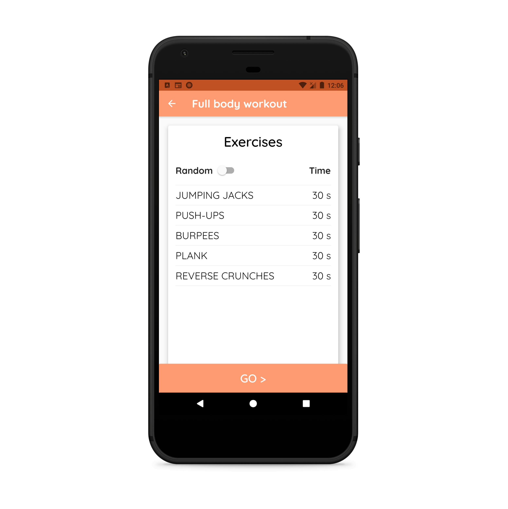

# FitMe Personal Trainer

<strong>Click on the gif below to Watch the Video:</strong>&nbsp;

## Overview
FitMe Personal Trainer is a fitness application built using Flutter with an MVC architecture. It offers personalized workout routines and comprehensive exercise instructions.

## Features
- **User Authentication**: Login and registration using Firebase Firestore.
- **User Profile**: After registering with email and password, users enter their age, username, weight, and height.
- **BMI Calculator**: Calculates BMI and indicates if the user is underweight, normal, or overweight.
- **Workout Categories**: Choose from Full Body Workout, Leg Workout, and Arm Workout. Each category provides detailed exercise instructions and video links.
- **Workout Timer**: Guides users through their workout sessions with a timer.

## Structure
- **lib**
  - **assets**: Assets like images and fonts.
  - **core**: Business logic and models.
    - **enums**: Enumerations for view states.
    - **models**: Data models for exercises and workout categories.
    - **services**: Services for audio, exercises, local storage, and navigation.
    - **viewmodels**: State management for various views.
  - **ui**: User interface components.
    - **router.dart**: Defines the app routes.
    - **shared**: Shared UI elements like colors.
    - **views**: UI screens.

## State Management
State management is handled using view models that extend `ChangeNotifier`, enabling reactive UI updates through the `notifyListeners` method.

## Setup
1. Clone the repository.
2. Run `flutter pub get` to install dependencies.
3. Run `flutter run` to start the application.

## Usage
- Navigate through different workout categories.
- Follow detailed exercise instructions.
- Track your progress and manage your workout routines.

<strong>App Screenshots:</strong>&nbsp;

## Contribution
Feel free to fork the repository and contribute through pull requests. Ensure adherence to coding standards and include necessary tests.

## License
This project is licensed under the MIT License.

